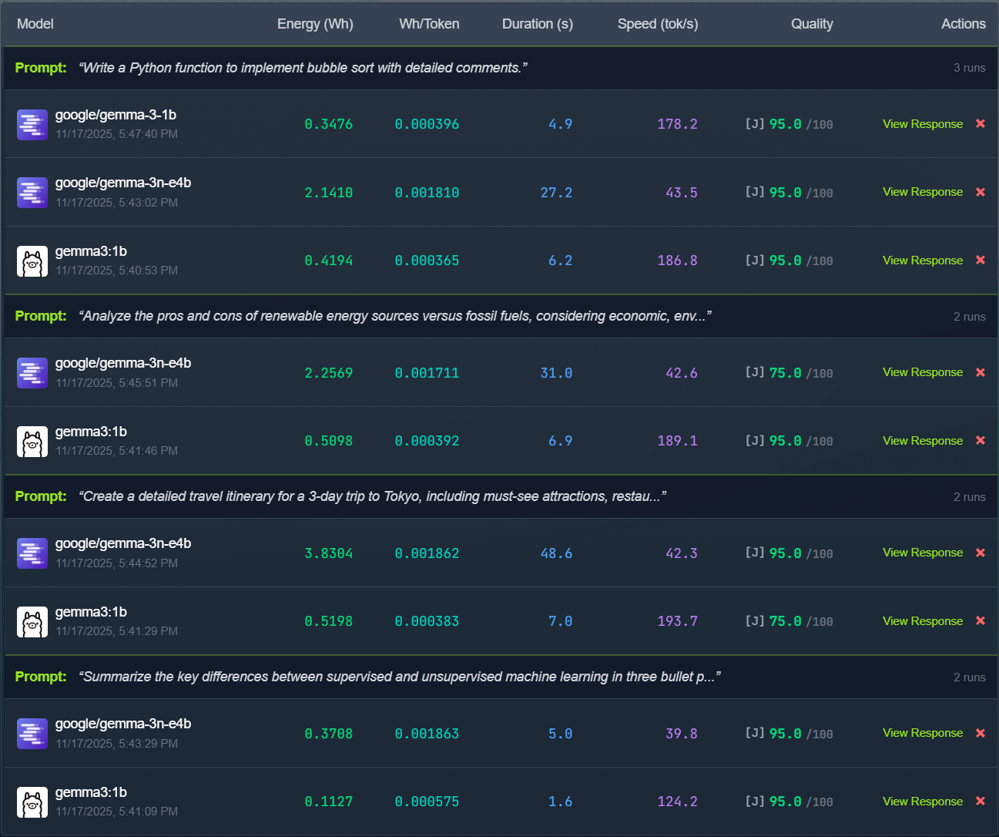
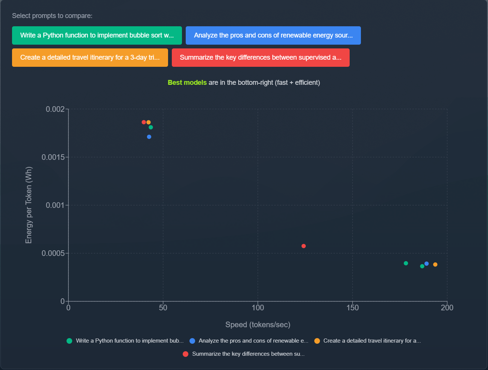
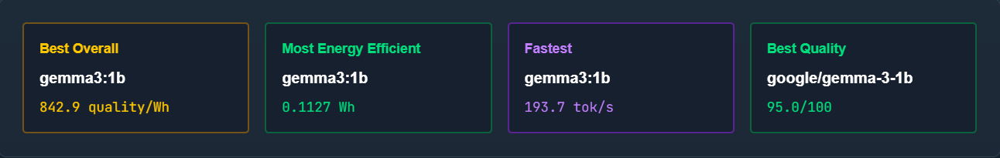

# EnviroLLM: Practical Resource Tracking and Optimization for Local AI

An open-source toolkit for tracking, benchmarking, and optimizing energy and resource usage when running Large Language Models (LLMs) locally.

🌐 **Live Site**: [envirollm.com](https://envirollm.com)

## Project Overview

Large language models are increasingly being deployed locally for privacy and accessibility reasons. However, users currently lack tools to measure or optimize their energy and resource impact. EnviroLLM aims to fill this gap by providing practical monitoring and optimization capabilities.

### Key Features
- **Real-Time Monitoring**: Track energy consumption and resource usage with visual dashboards
- **Inference Benchmarking**: Measure tokens per second, latency, and inference performance across models
- **Task-Specific Presets**: 7 built-in prompt presets for different workload types (code generation, analysis, creative writing, etc.)
- **Multi-Platform Benchmarking**: Automated energy and performance testing for Ollama, LM Studio, vLLM, text-generation-webui, and other OpenAI-compatible APIs
- **LLM-as-a-Judge Evaluation**: Optional quality assessment using another LLM to evaluate response quality
- **Model Recommendations**: Automatically suggests best models based on quality/energy efficiency, speed, and energy use
- **Interactive Visualizations**: Compare models across prompts with energy/speed charts and side-by-side analysis
- **CLI Tool**: Command-line interface for detecting and monitoring system stats and LLM processes
- **Optimization Recommendations**: Hardware-specific suggestions for reducing energy consumption

## Getting Started

### CLI Tool (Quickest Way)

Monitor your local system in one command (no installation needed):

```bash
npx envirollm start
```

Then visit [envirollm.com](https://envirollm.com) to view your metrics!

**Requirements**: Node.js and Python 3.7+ installed on your system.

**Other CLI Commands**:
```bash
npx envirollm detect    # Detect LLM processes
npx envirollm track --auto    # Track LLM processes
npx envirollm status    # Check if service is running
npx envirollm benchmark --models llama3:8b,phi3:mini    # Benchmark Ollama models
npx envirollm benchmark-openai --url http://localhost:1234/v1 --model llama-3-8b    # Benchmark OpenAI-compatible APIs
npx envirollm clean    # Remove all stored benchmark data
```

### Data Storage

Benchmark results are stored locally at `~/.envirollm/benchmarks.db`. All data stays on your machine.

Export to CSV via the web interface or remove all data with:
```bash
npx envirollm clean
```

### Ollama Benchmarking

Automatically measure energy consumption and performance of Ollama models:

```bash
# Install Ollama (https://ollama.com)
ollama pull llama3:8b
ollama pull llama3:8b-q8

# Run benchmark
npx envirollm benchmark --models llama3:8b,llama3:8b-q8

# Custom prompt
npx envirollm benchmark --models phi3:mini --prompt "Write a sorting function"
```

**Metrics collected:**
- Energy consumption (Wh)
- Tokens per second
- CPU/GPU/memory usage
- Quantization detection (Q4, Q8, FP16)
- Response quality evaluation (heuristic or LLM-as-a-judge)
- Actual response output (for quality comparison)

### OpenAI-Compatible API Benchmarking

Benchmark LM Studio, vLLM, text-generation-webui, and other OpenAI-compatible APIs:

```bash
# LM Studio (default runs on http://localhost:1234/v1)
npx envirollm benchmark-openai --url http://localhost:1234/v1 --model llama-3-8b

# vLLM
npx envirollm benchmark-openai --url http://localhost:8000/v1 --model meta-llama/Llama-2-7b-hf

# Custom prompt
npx envirollm benchmark-openai --url http://localhost:1234/v1 --model phi-3-mini --prompt "Write a sorting function"

# With API key (if required)
npx envirollm benchmark-openai --url http://localhost:1234/v1 --model llama-3-8b --api-key your-key-here
```

Collects the same energy and performance metrics as Ollama benchmarking.

### Web Interface Benchmarking

Use the web dashboard at [envirollm.com/optimize](https://envirollm.com/optimize) for an interactive benchmarking experience:

**Task-Specific Presets:**
Choose from 7 preset prompts designed to test different workload types:
- **Explanation**: General knowledge and concept explanation
- **Code Generation**: Programming tasks with documentation
- **Summarization**: Concise information synthesis
- **Long-form Writing**: Extended content creation (travel guides, articles)
- **Analytical Writing**: Critical analysis and comparison
- **Data Analysis**: SQL queries and technical problem-solving
- **Creative Writing**: Fiction and narrative generation

Or use **Custom** to write your own prompt.

**Multi-Model Comparison:**
- Select multiple models from Ollama, LM Studio, or custom APIs
- Run identical prompts across all selected models
- View grouped results with interactive charts
- Get automatic recommendations for best overall, most efficient, fastest, and highest quality

**Example Workflow:**
1. Visit [envirollm.com/optimize](https://envirollm.com/optimize)
2. Click "Run Benchmark"
3. Select a task preset (e.g., "Code Generation") or write a custom prompt
4. Choose models to compare
5. View results with energy/speed visualizations and quality scores

**Screenshots:**

*Task-specific presets and multi-model selection:*


*Interactive comparison charts and energy/speed analysis:*


*Automatic model recommendations based on your benchmarks:*


### Development Setup

For local development of the web app:

```bash
git clone https://github.com/troycallen/envirollm
cd envirollm
npm install
npm run dev
```

Open [http://localhost:3000](http://localhost:3000) with your browser to see the result.

**Backend** (alternative to npx command):
```bash
cd cli/backend
pip install -r requirements.txt
python main.py
```

## Project Structure

```
envirollm/
├── src/
│   ├── app/                # Next.js app directory
│   │   ├── dashboard/      # Real-time monitoring dashboard
│   │   ├── faq/           # FAQ page
│   │   ├── globals.css    # Global styles
│   │   ├── layout.tsx     # Root layout
│   │   └── page.tsx       # Homepage
│   └── components/        # Reusable React components
│       └── NavBar.tsx     # Navigation component
├── cli/                   # CLI tool for local monitoring
│   ├── backend/           # Local metrics collection backend
│   │   ├── main.py        # Full API with recommendations
│   │   └── requirements.txt
│   ├── index.ts           # CLI source code
│   ├── index.js           # Compiled CLI executable
│   └── package.json       # CLI dependencies
├── public/                # Static assets
└── package.json           # Frontend dependencies
```

## Contributing

This project is part of CS 8903-CROCS (Computing Research Opportunities for Conservation and Sustainability) at Georgia Tech. 

### Background

My background is in systems and ML optimization. Volunteering with environmental organizations in Atlanta and New Smyrna Beach inspired my commitment to developing sustainable technology solutions.

## Deployment

The application is automatically deployed to [envirollm.com](https://envirollm.com) via Vercel and Railway when changes are pushed to the main branch.

## License

This project is open-source and available under the [MIT License](LICENSE).
